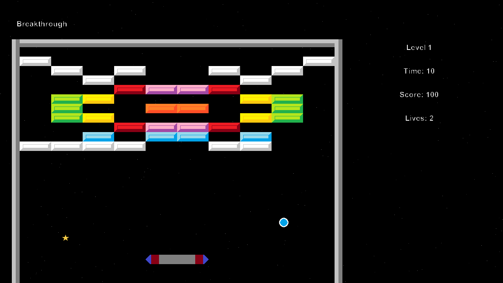

# Breakthrough
## Introduction
A game made by Gabriel Franz and Cornel Forster to get a grade in the Modul 226a.  
The game is about a paddle, a ball and a looooooot of bricks. The ball is moving in the game world. If it touches an object, it will bounce of it. You can only move the paddle left and right. The goal is to clear out all the bricks in the world.

## Start the game
They game should automatically start wif you click on the "Run" Button.  
If it doesn't work, click on the "Welcome" world, chose the option "new Welcome()" and and click on the "Run" Button.

## Modes
There are currently two different modes with one more to come.
### Singleplayer
In singleplayer you are the only player.
### Co-op
In co-op mode you and your coplayer play together.

## Controls
If you play in singleplayer you can either move your paddle left with the "a" or "left" arrow key, right with "d" or the "right" arrow key on your keyboard.  
Additionally you can increase the speed of your paddle with your "shift" or "space" key.

If you play in co-op mode, one player controls only one paddle (there are two):
- The first player controls the paddle with "a", "d" and "shift".
- The second player controls the paddle with "left", "right" arrow key and "space".
  
## Important functions
### Bricks
Bricks are static objects in the world.  
They are removed, if a ball touches them.  
**Attention:** There are bricks which can't get destroyed and there are also some bricks which must be hitten multiple times.

### Perks
Perks can randomly appear and if the paddle or the ball touches them, you will get one life.

### Ball
The ball increases it's speed over time.  
If it reaches the bottom screen border you loose one life.

### Lifes
You start with 3 lives. If you or the ball hits a perk, you will get one life extra.  
If you have 0 lives

### Score
The following actions updates your score:
- Brick removed: +50 Points
- Ball touched paddle: +10 Points
- Life gets removed: -500 Points

There is a scoreboard if you beat all levels.
